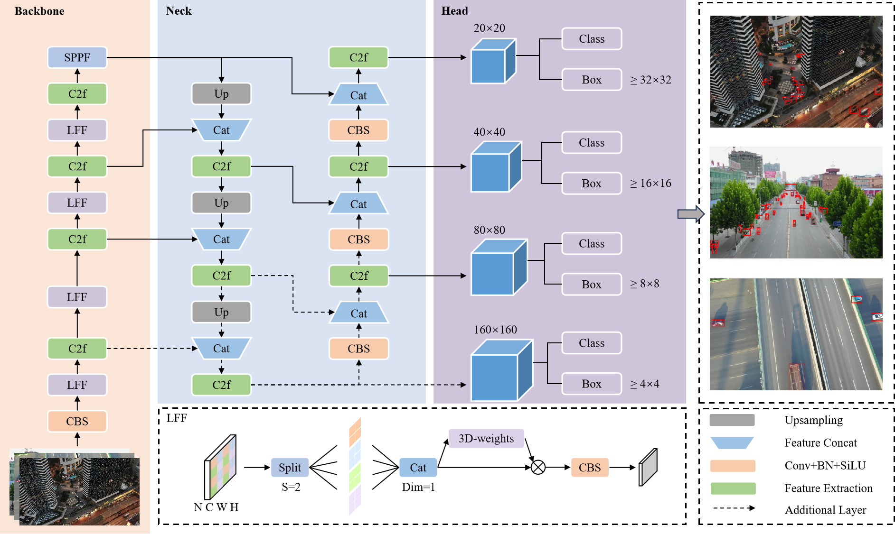
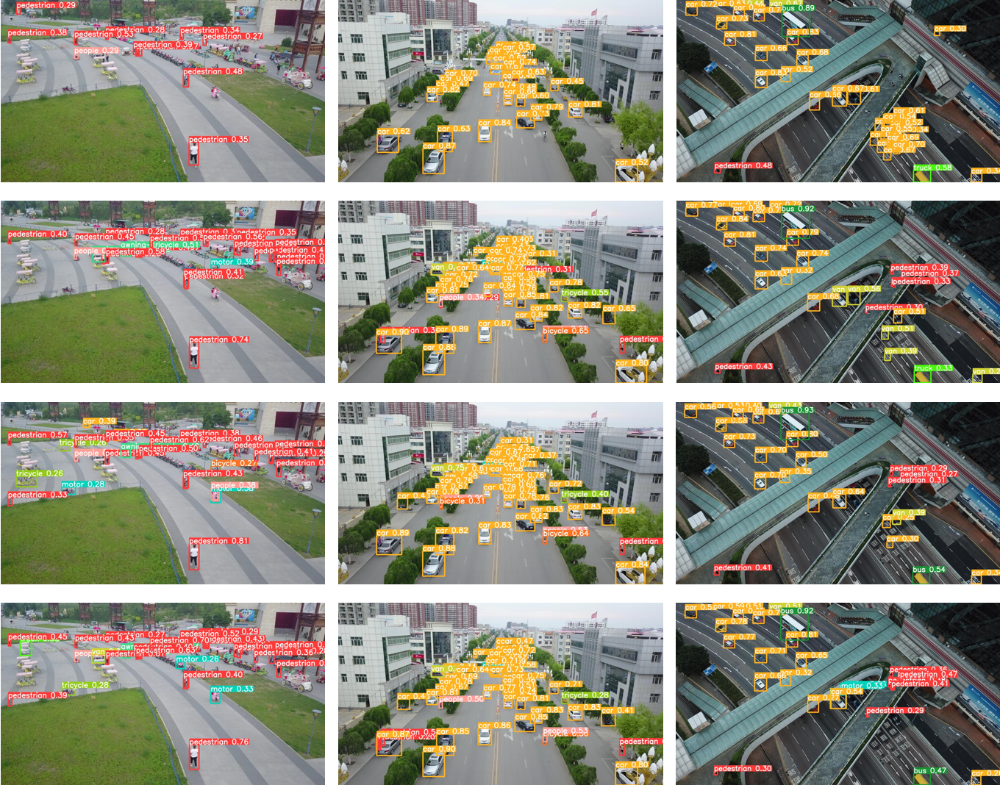

# LR-Net
LR-Net: Lossless Feature Fusion and Revised SIoU for Small Object Detection

# Method
The main architecture of network

# Result
The inference results by applying method Progressively from the VisDrone-2019 dataset.

